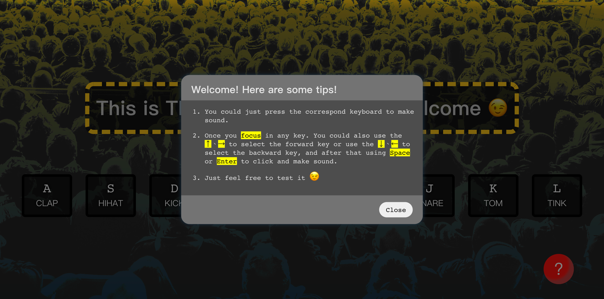

# JS30 - 01 drum kit

This is my solution for JS30 day one challenge!

## Table of contents
  - [Overview](#overview)
    - [The challenge](#the-challenge)
    - [Screenshot](#screenshot)
    - [Links](#links)
  - [My process](#my-process)
    - [Built with](#built-with)
    - [What I learned](#what-i-learned)
    - [Continued development](#continued-development)
  - [Acknowledgments](#acknowledgments)

## Overview

### The challenge

Users should be able to:

- Use the correspond keyboard key to make correspond sound.
- Use the arrowKey to go forward or backward the keys and press space or enter to make correspond sound.
- click the introduction button to know the rules and manipulation.

### Screenshot



<figure style="display: flex;">
  
  
</figure>

### Links

- Live Site URL: [01-drum-kit](https://beginneraboutlife116.github.io/JS30-01-drum-kit/)

## My process

### Built with

- Semantic HTML5 markup
- CSS custom properties
- Flexbox
- Mobile-first workflow

### What I learned

I have learned some basic knowledge about
1. `<audio> ` tag and `HTMLMediaElement`
   - I know `autoplay`, `controls`, `crossorigin`, `loop`, `muted`, `preload` these attribute that we could use it on the html tag.
   - And that we could use `HTMLMediaElement.play()` method to play the sound track.
   - Also we could use `HTMLMediaElement.currentTime` property to check current played time of the sound, even we could reset the time for replay the sound track.
   - Reference
     - [audio html tag](https://developer.mozilla.org/en-US/docs/Web/HTML/Element/audio)
     - [HTMLMediaElement](https://developer.mozilla.org/en-US/docs/Web/API/HTMLMediaElement)
2. `<dialog>` tag and `HTMLDialogElement`
   - This is for my initial introduction.
   - Because it may be a new feature, I have learned that if I want to increase the accessibility and to cover the old device and old browser, I could consider to use [Google Chrome/dialog-polyfill](https://github.com/GoogleChrome/dialog-polyfill) and [ally-dialog](https://a11y-dialog.netlify.app/) for solution.
   - In `HTMLDialogElement`, I could use `HTMLDialogElement.showModal()` which could give the user a default `Escape` keyboard function to close the modal.
   - Using `HTMLDialogElement.close()` to close the modal manually.
     ```js
     const dialog = document.querySelector('.dialog')
     const closeButton = document.querySelector('.dialog-close')

     dialog.showModal()
     closeButton.addEventListener('click', () => {
       dialog.close()
     })
     ```
   - And if we want to set color to the background when modal is opening, we need to use **pseudo-class:** `::backdrop`
     ```css
     .dialog::backdrop {
      background-color: hsla(0, 0%, 100%, 0.5);
     }
     ``` 
   - Reference:
     - [Html dialog spec](https://html.spec.whatwg.org/multipage/interactive-elements.html#the-dialog-element)
     - [In defence of dialog](https://whistlr.info/2021/in-defence-of-dialog/)
3. Event reference
    - I have use `keydown`, `click`, `focusout`, `keyup`, `transitionout` these events.
4. `HTMLElement.focus()`, `HTMLElement.blur()`
    - These are for my keyboard play mode. Trying to trace the arrowKey.
    - By these, I could make sure that I have the right focus style on the right key.

### Continued development

I would try to add the [Google Chrome/dialog-polyfill](https://github.com/GoogleChrome/dialog-polyfill) and to cover old browser device and to increase accessibility by using [ally-dialog](https://a11y-dialog.netlify.app/) tool, because I think that the `<dialog>` tag still needs to wait a while until every browsers start to use it.

## Acknowledgments

- [Google Chrome/dialog-polyfill](https://github.com/GoogleChrome/dialog-polyfill)
- [ally-dialog](https://a11y-dialog.netlify.app/)
- [Html dialog spec](https://html.spec.whatwg.org/multipage/interactive-elements.html#the-dialog-element)
- [In defence of dialog](https://whistlr.info/2021/in-defence-of-dialog/)
- [audio](https://developer.mozilla.org/en-US/docs/Web/HTML/Element/audio)
- [dialog](https://developer.mozilla.org/en-US/docs/Web/HTML/Element/dialog)
- [Event reference](https://developer.mozilla.org/zh-TW/docs/Web/Events)